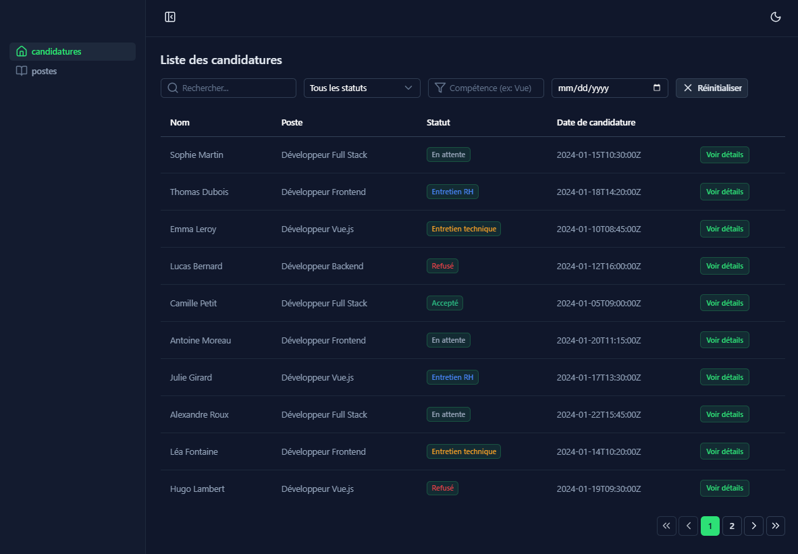
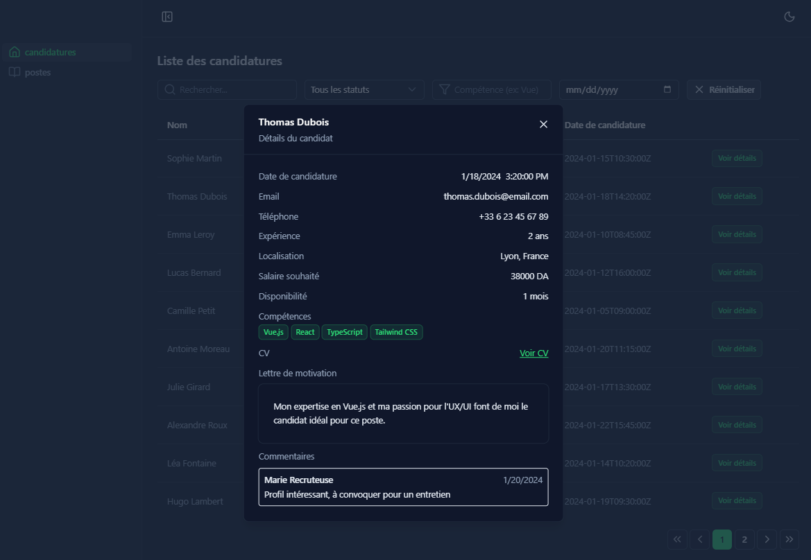
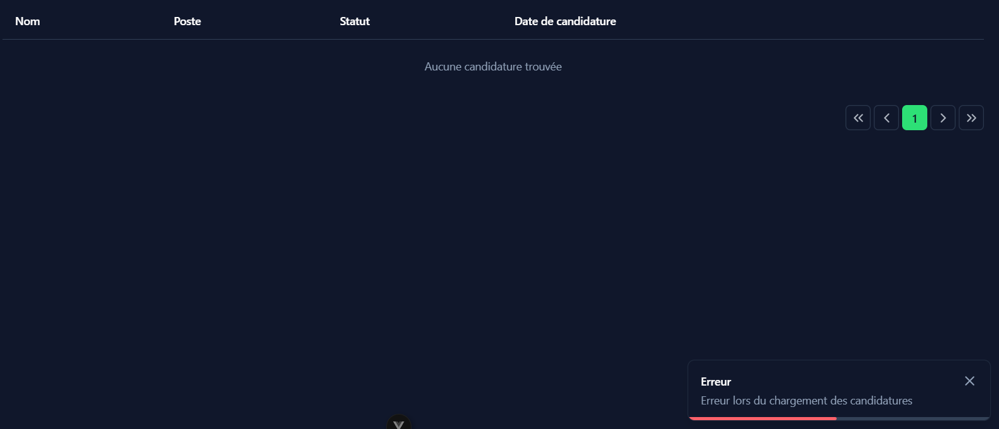

# test-technique-gestion-des-candidatures

This project is a technical assessment for Sig Service. all the requirements to run the project are listed below.

## Project Setup

### Install dependencies

```sh
npm install
```

### Install json-server globally

```sh
npm install -g json-server
```

### Create .env file

```sh
cp .env.example .env
```

### Run json-server and vite server

```sh
npm run start
```

## Time Spent

- Project setup: 30 minutes
- Interface development: 4 hours
- Refactoring: 1 hour

## Technical Choices

**NuxtUI** — Chosen for familiarity and to avoid boilerplate for UI components, loading states, and common functionality.

## Screenshots of the interface





## Future Improvements

- Better separation of concerns between UI And API layer
- unit test coverage
- Custamizable composables

## Analysis and Diagnosis

- [x] Analyze the typical problems that recruiters may encounter:
  - Large volume of applications to process
  - Need to quickly filter by skills, experience, status
  - Collaboration between several recruiters
  - Monitoring the progress of each candidate

- **My approach**
  - Add real-time search using ?q=
  - Use API filters (query params) instead of filtering in frontend
  - Keep UI simple and scannable
  - Show loading + error states clearly
  - Use pagination to avoid loading too much data at once

## Todo List

- [x] **Data retrieval and display via API** :
  - [x] Upload applications from`GET /candidatures`
  - [x] Load statuses from`GET /statuts`
  - [x] Load posts from`GET /postes`
  - [x] Displaying a loading status during requests
  - [x] Manage network errors
- [x] **List of candidates** including:
  - [x] Displayed information: name, position, status, application date
  - [x] Multiple filtering system (status, skills, date) using JSON Server query parameters
  - [x] Real-time search bar (using `?q=`JSON Server)
  - [x] Pagination (using `_page_limit`JSON Server)
- [ ] **Application details** :
  - [x] Modal view or dedicated page
  - [x] Loading via`GET /candidatures/:id`
  - [x] Displaying the candidate's complete information
  - [ ] Possible actions:
    - Change the status (PATCH `/candidatures/:id`)
    - Add a comment (PATCH `/candidatures/:id`)
- [ ] **State management** :
  - [x] Use Pinia or Vuex for state management
  - [x] Store the data retrieved from the API
  - [ ] Synchronize local state with the API
  - [ ] Persist certain user preferences (active filters, preferred view)

### **Bonus features (for Mid-Level):**

- [ ] Drag and drop to change the application status
- [ ] Notification/Alert System
- [x] Dark Mode
- [ ] Unit tests (Vitest/Jest)
- [x] Smooth animations (View or library transitions)
- [ ] Optimistic UI updates
- [ ] Cache management and data refresh

### **Part 3: Code Quality (1 hour)**

Your code must demonstrate:

- [x] Reusable component structure
- [x] Props and events management in-house
- [x] Using the Composition API (or API Options with justification)
- [x] Responsive design (mobile-first)
- [x] Basic accessibility (ARIA, keyboard navigation)
- [x] Clear naming conventions
- [x] Robust error handling for API calls

---

## **Expected Technical Stack**

**Mandatory :**

- [x] vue 3
- [x] **JSON Server** (provided with db.json) - REQUIRED for data
- [x] TypeScript (highly recommended) or JavaScript
- [x] CSS (SCSS/Tailwind/styled-components au choix)
- [x] State management (Pinia/Vuex)
- [x] Axios or Fetch API for HTTP requests
- [x] Network error handling
- [x] load states

**Optional:**

- [x] Router View
- [x] Vite
- [x] ESLint + Prettier
- [ ] composables
